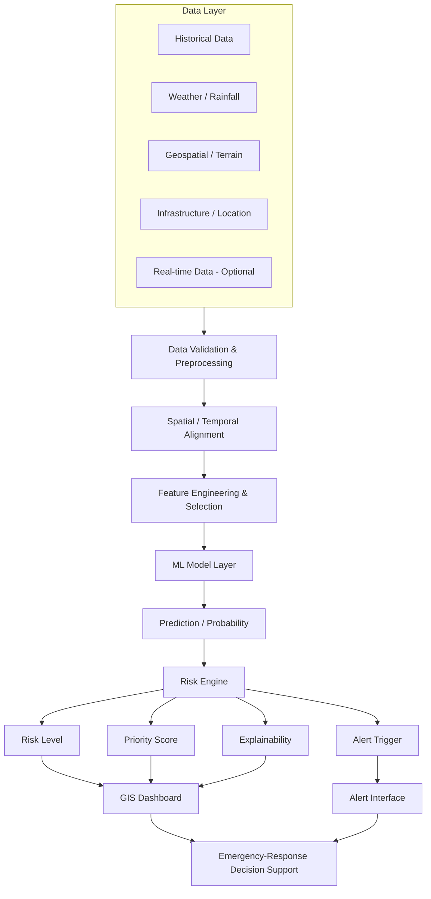

# Intelligent Disaster Risk Management and Emergency Response System

> **Predict Early. Identify Risk. Alert in Time. Respond Faster.**

An intelligent, data-driven platform that combines **Machine Learning, Geospatial Analysis, Risk Classification, Early Alerts, GIS Visualization, and Emergency-Response Decision Support** into one workflow.

The project is being developed as a **modular, research-oriented MVP**. The implementation will be based on the existing repository and will grow incrementally as the dataset, prediction target, and evaluation strategy are finalized.

---

## Project Overview

Disaster risk can change rapidly across locations, while the available environmental data and response resources are often limited. This project aims to connect **risk assessment** with the next practical steps: **classification, alerting, visualization, and response prioritization**.

### Core Workflow


---

## Objectives

- Assess disaster-related risk using relevant historical, environmental, geographical, and available real-time data.
- Build reproducible ML pipelines for prediction and evaluation.
- Convert model outputs into understandable risk levels.
- Visualize risk spatially through a GIS-oriented dashboard.
- Generate location-specific alerts and response-priority information.
- Keep the system explainable, testable, and suitable for collaborative development.

---

## Key Features

### Multi-source Data
Historical events, rainfall/weather, terrain, land/environmental indicators, infrastructure/location information, and real-time sources where the selected implementation supports them.

### Machine Learning
Baseline model comparison first, followed by advanced models only when justified by the data and experiments.

### Risk Classification
A configurable risk layer using categories such as:

**Low → Moderate → High → Critical**

### Explainability
Show the main factors contributing to a prediction where the selected model supports reliable explanations.

### GIS Visualization
Map-based risk display, location/asset details, filtering, and contributing-factor views.

### Alerts & Prioritization
Convert risk results into location-specific alerts and an ordered priority view for human decision support.

> **Important:** The system is a decision-support tool. It does not replace engineers, disaster-management authorities, field teams, or official warning systems.

---

## Research Foundation

### Base Paper

**Mishra et al. (2026)**

*Integrating Machine Learning and Geospatial Analysis for Flood Hazard, Vulnerability, and Risk Assessment in Odisha, India*

**Journal:** Water Resources Management  
**DOI:** `10.1007/s11269-026-04709-w`

The base study combines geospatial analysis and machine learning for flood **hazard, vulnerability, and risk assessment** in Odisha.

**Reported ML models:**

- Random Forest
- Bagging
- Support Vector Machine (SVM)
- K-Nearest Neighbours (KNN)
- Generalized Linear Model (GLM)

### Project Direction

The proposed project uses the literature as a foundation for risk assessment and extends the workflow toward:

```text
Risk Assessment
      ↓
Risk Classification
      ↓
Explainability / Reliability
      ↓
Priority Decision
      ↓
GIS Visualization
      ↓
Location-Specific Alerts
      ↓
Emergency-Response Support
```

The project does **not** claim that these individual concepts are new; the intended contribution is their integration into one practical workflow.

---

## System Architecture



---

## Implementation Strategy

The project will be implemented in small, verifiable stages rather than as a full rewrite.


### Development Rule

**Inspect → Plan → Implement → Test → Verify → Commit → Review → Next Phase**

The existing repository must be inspected before adding new modules or changing working code.

---

## ML Approach

The exact prediction target and final model are intentionally **not hard-coded in this README** until the dataset is finalized.

The expected progression is:

```text
Dataset + Target Definition
          ↓
Data Validation
          ↓
Baseline Model(s)
          ↓
Proper Evaluation
          ↓
Error / Failure Analysis
          ↓
Feature Improvement
          ↓
Model Comparison
          ↓
Advanced Model (only if justified)
```

Potential baseline candidates include **Random Forest** and **XGBoost**, but the final model will be chosen based on the actual dataset, task, and evaluation results.

### Evaluation

Depending on the prediction task, evaluation may include:

- Precision / Recall / F1
- ROC-AUC or PR-AUC
- Confusion Matrix
- Cross-validation
- Calibration / probability reliability
- Geographic generalization
- Error and failure-case analysis

Model performance must be evaluated on data that is not improperly exposed during training.

---

## Data Principles

The final dataset must be documented before model training.

For every dataset, document:

- source
- license / usage terms
- spatial coverage
- temporal coverage
- variables
- target availability
- preprocessing
- known limitations

### Leakage Control

Particular attention will be given to:

- future information entering training features;
- target-derived features;
- incorrect spatial joins;
- duplicated observations across train/test;
- preprocessing fitted on the complete dataset before splitting;
- temporal or geographic leakage.

---

## Repository Structure

The project will reuse the current repository structure wherever practical. A target organization is shown below for reference.

```text
intelligent-disaster-risk-management/
│
├── README.md
├── CONTRIBUTING.md
├── LICENSE
│
├── docs/
│   ├── architecture/
│   ├── research/
│   ├── datasets/
│   └── experiments/
│
├── data/
│   ├── raw/
│   ├── processed/
│   └── samples/
│
├── ml/
│   ├── preprocessing/
│   ├── features/
│   ├── models/
│   ├── evaluation/
│   └── explainability/
│
├── backend/
│   ├── app/
│   ├── api/
│   ├── services/
│   └── tests/
│
├── frontend/
│   ├── src/
│   ├── components/
│   ├── pages/
│   └── services/
│
├── notebooks/
└── tests/
```

> This is a target structure, not a requirement to recreate or duplicate folders that already exist.

---

## Technology Direction

| Layer | Preferred / Candidate Tools |
|---|---|
| Data / ML | Python, Pandas, NumPy, scikit-learn, XGBoost where justified |
| Geospatial | GeoPandas, Rasterio, mapping library |
| Backend | FastAPI, if compatible with the existing repository |
| Database | PostgreSQL / PostGIS, if spatial persistence is required |
| Frontend | React or the existing lightweight frontend |
| Development | Git, GitHub, Docker where useful |

Technology is selected based on **actual project requirements**, not by adding tools for presentation value.

---

## Collaboration

Recommended Git workflow:

```text
main
  └── dev
       ├── feature/ml
       ├── feature/geospatial
       ├── feature/backend
       ├── feature/dashboard
       └── feature/alerts
```

### Contribution Flow

```text
Create Branch
     ↓
Implement Small Change
     ↓
Run Tests
     ↓
Commit
     ↓
Pull Request
     ↓
Review
     ↓
Merge
```

`main` should remain stable and review-ready.

---

## Low-Spec Development Strategy

The project should remain usable on modest hardware.

### Local machine

- API development
- dashboard development
- sample-data processing
- unit/integration tests
- small ML experiments

### Stronger machine / cloud when required

- large model training
- high-resolution raster processing
- GPU experiments
- expensive hyperparameter searches

Heavy workloads should remain separable from normal application development.

---

## Responsible Use

Predictions are **decision-support outputs**, not guarantees.

The system should never be presented as:

- an official disaster-warning authority;
- a replacement for professional engineering inspection;
- an autonomous emergency command system;
- a guarantee that a location is safe or unsafe.

Uncertainty and limitations must be communicated wherever they materially affect interpretation.

---

## Current Status

**Planning / Implementation Preparation**

Current focus:

1. Audit the existing repository.
2. Finalize the dataset and prediction target.
3. Build the smallest reliable end-to-end MVP.
4. Evaluate and validate the ML pipeline.
5. Add the decision-support, GIS, and alert layers.
6. Expand only after the core workflow is stable.

---

## Documentation

Recommended project documents:

- `README.md` — project overview and developer entry point
- `docs/architecture/` — system diagrams and architecture decisions
- `docs/research/` — literature review and research notes
- `docs/datasets/` — dataset sources and schemas
- `docs/experiments/` — model experiments and results

A dedicated architecture/diagram document can be maintained as `docs/architecture/DIAGRAM.md` when the final repository structure is established.

---

## Team

**Department of Computer Science and Engineering**  
**Academic Year: 2026–27**

- KATTARI PRINCY VENEELA 
- CHANDAN KUMAR SAH TELI
- CHINTHA SWAPNA
- ALLAM B V ESWARA SAI

**Guide:** JYOTHULA VIDYA, Asst. Professor
