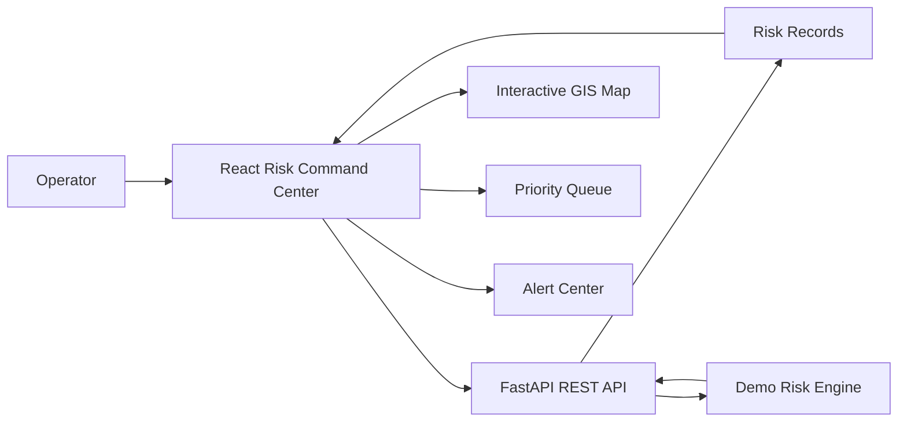
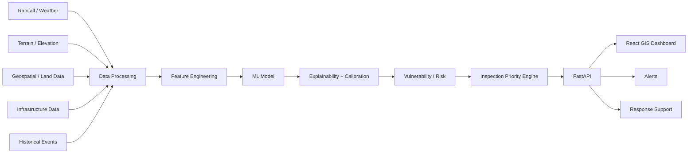

# INFRAguard AI Architecture

## Current demo path

## Target research path

## Demo boundary

The present dashboard intentionally uses deterministic demo records and a transparent rule-based risk engine. It is a software integration milestone, not the final trained research model.
